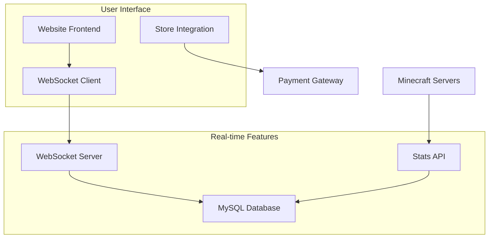

# 🎮 SeasonsMC Website

> **Modern, responsive website for SeasonsMC Minecraft server network featuring real-time statistics, custom game modes showcase, and professional server store integration.**

[](https://seasonsmc.store)
[](https://seasonsmc.store)
[](https://discord.gg/gF3rENxuGq)

---

## 🚀 Overview

The **SeasonsMC Website** is a cutting-edge, modern web platform designed specifically for our Minecraft server network. Built with performance, user experience, and real-time functionality in mind.

### ✨ Key Features

- **🔥 Real-time Player Statistics** - Live WebSocket connection showing current players
- **🎮 Custom Game Modes Showcase** - Detailed information about GunGame and FFA
- **🛒 Integrated Store** - Seamless rank purchasing experience
- **📊 Live Leaderboards** - Real-time top players display
- **📱 Mobile Responsive** - Perfect experience on all devices
- **⚡ Lightning Fast** - Optimized performance and loading times
- **🎨 Modern Design** - Clean, gaming-focused aesthetic

---

## 🛠️ Tech Stack

### **Frontend**


### **Backend Integration**


### **Infrastructure**


---

## 🏗️ Architecture



---

## 📁 Project Structure

```
seasonsmc-website/
├── 📄 index.html              # Main website file
├── 🎨 assets/
│   ├── css/
│   │   └── style.css          # Main stylesheet
│   ├── js/
│   │   ├── main.js            # Core functionality
│   │   ├── websocket.js       # Real-time stats
│   │   └── stats-client.js    # Stats API client
│   └── images/
│       ├── logo.png
│       └── backgrounds/
├── 📊 api/
│   └── stats.js               # Statistics endpoints
├── 🛒 store/
│   └── index.html             # Store integration
├── 📱 mobile/
│   └── responsive.css         # Mobile optimizations
└── 📋 README.md
```

---

## 🎮 Game Modes Featured

### 🔫 **GunGame Arena**
```yaml
Features:
  - 6-tier weapon progression (Wooden → Netherite)
  - Advanced division system (Bronze → Unreal)
  - Custom abilities at Level 10+ and 20+
  - Killstreak rewards with progressive armor
  - Points system: 5pts/kill + bonuses
  - Real-time leaderboards
  
Technology:
  - Custom Java plugin integration
  - Real-time stats via WebSocket
  - MySQL database backend
```

### ⚔️ **Free-For-All Combat**
```yaml
Features:
  - Dual kit system (Speed vs Beast)
  - Unbreakable equipment with enchantments
  - Strategic spawn protection
  - Points system: 3pts/kill + bonuses
  - Instant respawn mechanics
  
Technology:
  - Kit selection GUI integration
  - Live player tracking
  - Performance optimized combat
```

---

## 🔥 Real-time Features

### **Live Statistics Dashboard**
- 📊 **Player Count**: Real-time online players across all servers
- 🏆 **Leaderboards**: Top 5 players per game mode (updates live)
- 🌐 **Server Status**: Online/offline status with latency monitoring
- 📈 **Network Stats**: Total players, servers, and uptime

### **WebSocket Integration**
```javascript
// Real-time stats connection
const stats = new SeasonsMCStats('wss://stats.seasonsmc.store/ws');

stats.on('statsUpdate', (data) => {
    updatePlayerCounts(data.network.total_players);
    updateLeaderboards(data.leaderboards);
    updateServerStatus(data.servers);
});
```

---

## 🛒 Store Integration

### **Rank Packages**
- 💎 **Diamond Rank** - $9.99 (Most Popular)
- 💚 **Emerald Rank** - $19.99 
- 👑 **Gold Rank** - $34.99 (Best Value)
- ⭐ **Legend Rank** - $49.99 (Ultimate)

### **Features**
- Secure payment processing
- Instant rank delivery
- Detailed feature comparisons
- Mobile-optimized checkout

---

## 🚀 Performance Features

### **Optimization**
- ⚡ **Lazy Loading**: Images and content loaded as needed
- 🗜️ **Minified Assets**: Compressed CSS/JS for faster loading
- 📱 **Responsive Design**: Optimized for all screen sizes
- 🔄 **Caching**: Smart caching for static resources

### **Analytics**
- 📊 Real-time visitor tracking
- 🎯 Conversion rate monitoring
- 📈 Performance metrics dashboard
- 🔍 User behavior analysis

---

## 📱 Mobile Experience

### **Responsive Design**
- 📱 Mobile-first approach
- 🎮 Touch-optimized gaming interface
- ⚡ Fast loading on mobile networks
- 🔄 Swipe gestures for navigation

### **Mobile Features**
- 📋 One-tap server IP copy
- 🎯 Quick Discord/Store access
- 📊 Simplified stats display
- 🎮 Mobile-friendly game mode cards

---

## 🔧 Development Setup

### **Prerequisites**
```bash
# Required
- Web server (Nginx/Apache)
- Node.js 18+ (for WebSocket server)
- MySQL 8.0+
- SSL Certificate (for WebSocket)
```

### **Installation**
```bash
# Clone repository
git clone https://github.com/SixSeasons/seasonsmc-website.git
cd seasonsmc-website

# Setup WebSocket server
cd websocket-server
npm install
npm start

# Configure web server
# Copy files to web root
# Update WebSocket URLs in config
```

### **Configuration**
```javascript
// config.js
const config = {
    websocket: {
        url: 'wss://stats.seasonsmc.store/ws',
        fallbackApi: 'https://stats.seasonsmc.store/api/stats'
    },
    server: {
        ip: 'play.seasonsmc.store',
        version: '1.9+'
    },
    store: {
        url: 'https://store.seasonsmc.store'
    }
};
```

---

## 📊 API Endpoints

### **Statistics API**
```http
GET /api/stats
```
```json
{
  "success": true,
  "data": {
    "network": {
      "total_players": 127,
      "total_servers": 3,
      "last_updated": "2025-01-27T10:30:00Z"
    },
    "servers": [
      {
        "server_name": "GunGame-1",
        "gamemode": "GunGame",
        "players_online": 45,
        "status": "ONLINE"
      }
    ],
    "leaderboards": {
      "gungame": [...],
      "ffa": [...]
    }
  }
}
```

### **Player Count API**
```http
GET /api/players/count
```

### **Leaderboard API**
```http
GET /api/leaderboard/{gamemode}
```

---

## 🎨 Design System

### **Color Palette**
```css
:root {
    --primary: #3b82f6;      /* Primary Blue */
    --secondary: #06b6d4;    /* Cyan */
    --accent: #8b5cf6;       /* Purple */
    --success: #10b981;      /* Green */
    --warning: #f59e0b;      /* Orange */
    --danger: #ef4444;       /* Red */
    --dark: #0f0f0f;         /* Background */
    --card: #1e1e1e;         /* Card Background */
}
```

### **Typography**
- **Primary Font**: Inter (Modern, clean)
- **Headers**: 800-900 weight
- **Body**: 400-500 weight
- **Accent**: RGB gradient text

### **Components**
- 🃏 **Game Mode Cards**: Hover animations, gradient borders
- 📊 **Stat Cards**: Live updating numbers
- 🛒 **Store Cards**: Purchase CTAs, feature lists
- 📱 **Mobile Nav**: Collapsible, touch-friendly

---

## 🔒 Security Features

### **Frontend Security**
- 🛡️ CSP (Content Security Policy) headers
- 🔐 HTTPS enforcement
- 🚫 XSS protection
- 🔒 Secure WebSocket connections

### **API Security**
- 🔑 Rate limiting
- 🛡️ Input validation
- 🔐 Secure headers
- 📊 Request monitoring

---

## 📈 Analytics & Monitoring

### **Performance Monitoring**
- ⚡ Page load times
- 📊 Real-time user count
- 🔄 WebSocket connection status
- 📱 Mobile performance metrics

### **Business Metrics**
- 💰 Store conversion rates
- 🎮 Game mode popularity
- 👥 User engagement
- 📈 Growth trends

---

## 🚀 Deployment

### **Production Environment**
```bash
# Build and deploy
npm run build
rsync -av dist/ user@server:/var/www/seasonsmc.store/

# Start services
systemctl start seasonsmc-stats
systemctl start nginx

# Monitor
tail -f /var/log/seasonsmc-website.log
```

### **Environment Variables**
```env
WEBSOCKET_URL=wss://stats.seasonsmc.store/ws
API_URL=https://stats.seasonsmc.store/api
STORE_URL=https://store.seasonsmc.store
SERVER_IP=play.seasonsmc.store
```

---

## 🤝 Contributing

We welcome contributions! Please see our [Contributing Guidelines](CONTRIBUTING.md).

### **Development Process**
1. 🍴 Fork the repository
2. 🌿 Create feature branch (`git checkout -b feature/amazing-feature`)
3. 💾 Commit changes (`git commit -m 'Add amazing feature'`)
4. 📤 Push to branch (`git push origin feature/amazing-feature`)
5. 🔄 Open Pull Request

### **Code Standards**
- ✅ ESLint configuration
- 💅 Prettier formatting
- 📝 JSDoc comments
- 🧪 Unit tests for critical functions

---

## 📋 Roadmap

### **Q1 2025**
- [ ] 🎮 Player profile pages
- [ ] 📊 Advanced statistics dashboard
- [ ] 🏆 Achievement system
- [ ] 📱 Progressive Web App (PWA)

### **Q2 2025**
- [ ] 🎨 Theme customization
- [ ] 🌍 Multi-language support
- [ ] 📈 Enhanced analytics
- [ ] 🔔 Push notifications

### **Q3 2025**
- [ ] 🎮 In-browser mini-games
- [ ] 🏪 Enhanced store features
- [ ] 📱 Mobile app integration
- [ ] 🤖 AI-powered recommendations

---

## 📞 Support & Contact

### **Technical Support**
- 🐛 **Bug Reports**: [GitHub Issues](https://github.com/SixSeasons/seasonsmc-website/issues)
- 💬 **Discord**: [discord.gg/seasonsmc](https://discord.gg/seasonsmc)
- 📧 **Email**: support@seasonsmc.com

### **Business Inquiries**
- 👨‍💼 **Owner**: Charlotte (SixSeasons)
- 📧 **Email**: charlotte@seasonsmc.com
- 💼 **LinkedIn**: [SixSeasons](https://linkedin.com/in/sixseasons)

---

## 📄 License

This project is licensed under the **MIT License** - see the [LICENSE](LICENSE) file for details.

---

## 🙏 Acknowledgments

- 🎮 **Minecraft Community** for inspiration
- 🛠️ **Open Source Libraries** used in this project
- 👥 **SeasonsMC Players** for feedback and support
- ☕ **Coffee** for powering late-night coding sessions

---

<div align="center">

### 🌟 **Star this repository if you found it helpful!**


**Made with ❤️ by the SeasonsMC Team**

[🌐 Website](https://seasonsmc.store) • [🎮 Server](https://seasonsmc.store) • [💬 Discord](https://discord.gg/seasonsmc) • [🛒 Store](https://store.seasonsmc.store)

</div>

---

*Last updated: January 2025*
